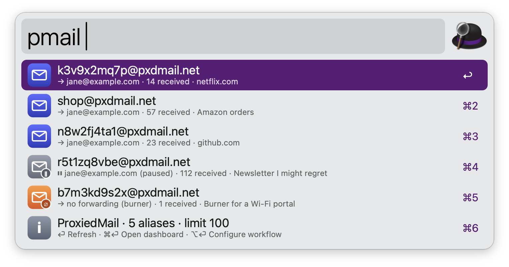
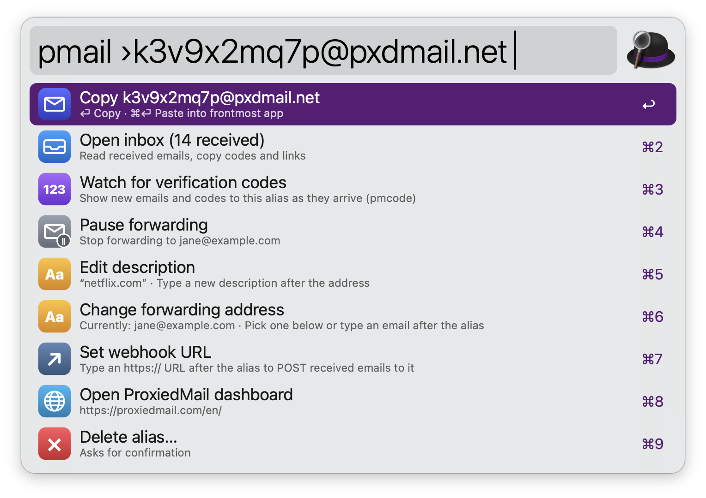
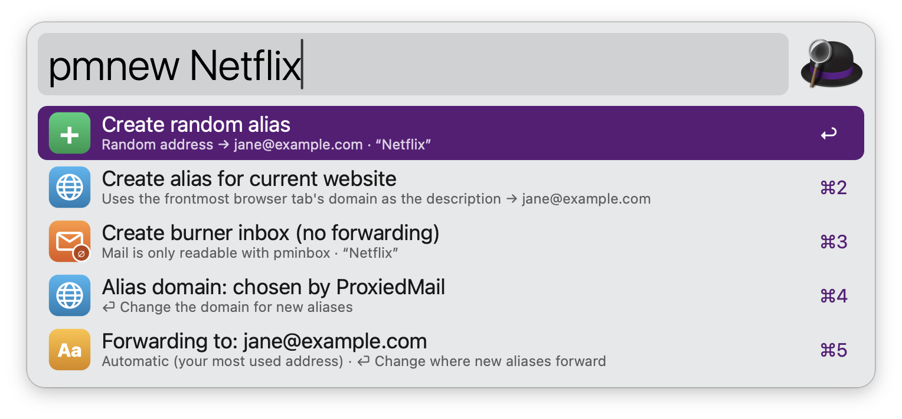
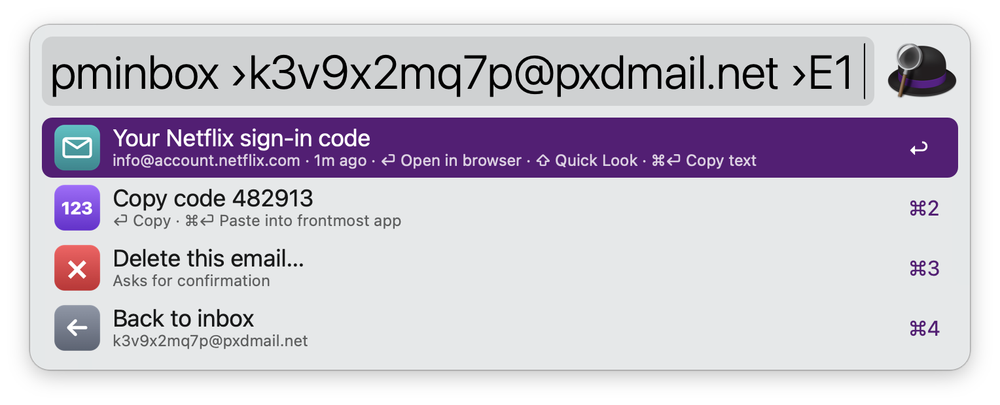
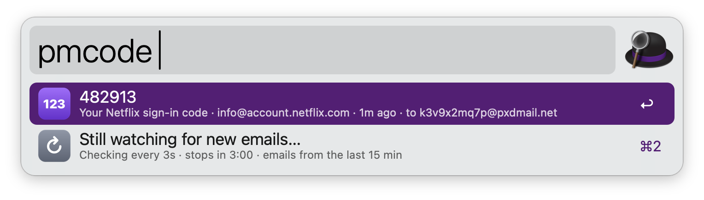

#  ProxiedMail for Alfred

An [Alfred 5](https://www.alfredapp.com) workflow for [ProxiedMail](https://proxiedmail.com) email aliases. You can search, create, pause, edit and delete aliases, read their inboxes, and catch verification codes without leaving the keyboard.

## Install

1. Download `ProxiedMail.alfredworkflow` from the [latest release](../../releases/latest) and open it. Requires Alfred 5 with the [Powerpack](https://www.alfredapp.com/powerpack/).
2. Paste your API token from the [ProxiedMail settings](https://proxiedmail.com/en/settings) into the configuration window.

## Usage

Search your aliases via the `pmail` keyword. Type to filter by address, description, or forwarding address.



* <kbd>↩</kbd> Copy alias.
* <kbd>⌘</kbd><kbd>↩</kbd> Paste alias into the frontmost app.
* <kbd>⌥</kbd><kbd>↩</kbd> Open alias inbox.
* <kbd>⌃</kbd><kbd>↩</kbd> Pause or resume forwarding.
* <kbd>⇧</kbd><kbd>↩</kbd> Show more actions: edit description, change forwarding address, set webhook, watch for codes, delete alias.



Create aliases via the `pmnew` keyword, optionally followed by a description. Start with `name@` for a custom address, e.g. `pmnew shop@ Amazon orders`.



* <kbd>↩</kbd> Create alias and copy it (or paste it, as set in the Workflow’s Configuration).
* <kbd>⌘</kbd><kbd>↩</kbd> Create alias and do the opposite of the above.
* <kbd>⌥</kbd><kbd>↩</kbd> Create alias, copy it, and wait for its first email and code.

Create a random alias, one described by the website in the frontmost browser tab, or a burner inbox with no forwarding. Choose the domain and forwarding address for new aliases from the rows below the create options.

Read received emails via the `pminbox` keyword. Open them (with remote images blocked), copy verification codes, or open their links. Emails can only be read for aliases with inbox browsing on.



Watch for verification codes via the `pmcode` keyword. It checks for new emails every few seconds for three minutes.



Alternatively, search aliases from selected text or create an alias for a selected URL via the Universal Actions. Configure the Hotkeys to create an alias for the current website in one step, or to jump to the latest codes.

## Privacy

- Your API token stays in Alfred's workflow configuration and is sent only to ProxiedMail. It's passed to `curl` on stdin, so it never appears in the process list.
- Emails are rendered locally with remote images and scripts blocked by default, so senders can't track when you open them.
- No analytics and no third-party services.

## Development

```
workflow/            The workflow bundle (what gets zipped)
  proxiedmail.js     All logic in JXA (osascript -l JavaScript); no dependencies
  info.plist         Generated by tools/build.py (don't edit by hand)
  icon.png, icons/   Generated by tools/make_icons.swift
tools/demo/          Demo data (demo.sh on|off) and screenshot capture (shoot.sh)
tools/build.py       Writes info.plist and packages dist/ProxiedMail.alfredworkflow
tools/make_icons.swift  Renders all icons with AppKit
test/run.sh          Runs every mode against fixtures in test/fixtures
```

```bash
test/run.sh
```

```bash
python3 tools/build.py
```

```bash
python3 tools/build.py --install
```

`--install` updates an already-installed copy in place and keeps its configuration.

Script Filters call `./proxiedmail.js <mode> "$1"` and return Alfred JSON. Sub-views are encoded in the query with `›` (for example `pmail ›alias@x.com ` for the actions view). Every actionable row's `arg` is `{"op": …}` JSON handled by `./proxiedmail.js run`. That returns variables which a Conditional routes to copy, paste or a notification.

## Credits

This workflow was built with the help of an AI assistant (Claude). It's not affiliated with ProxiedMail.
